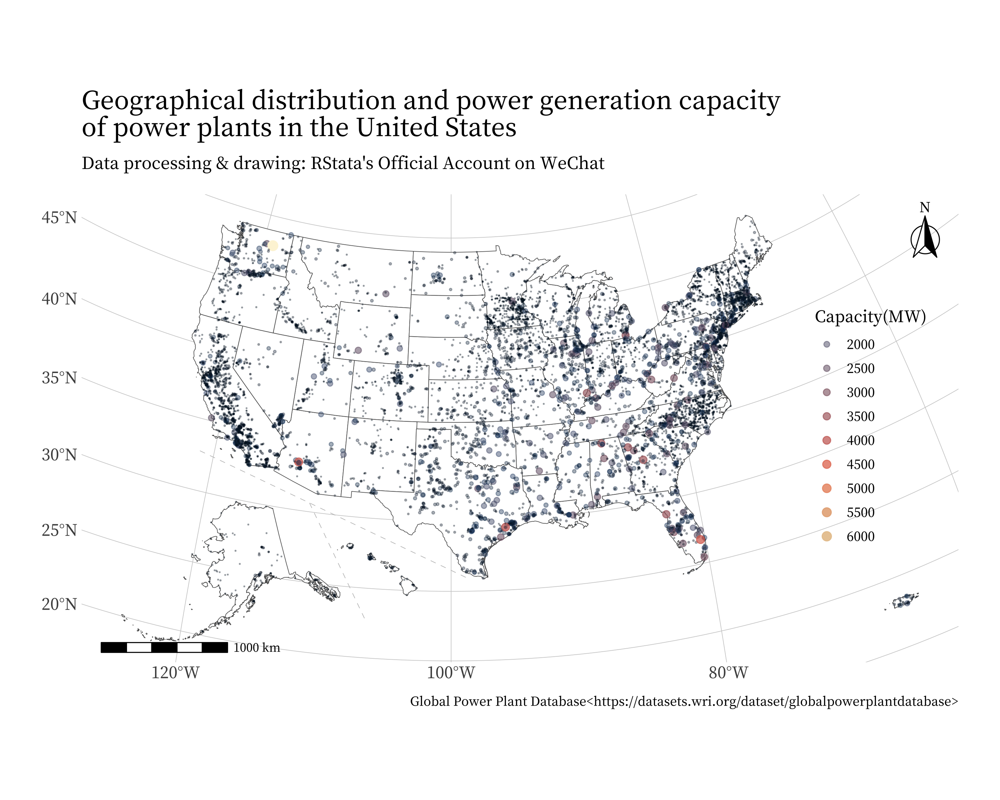
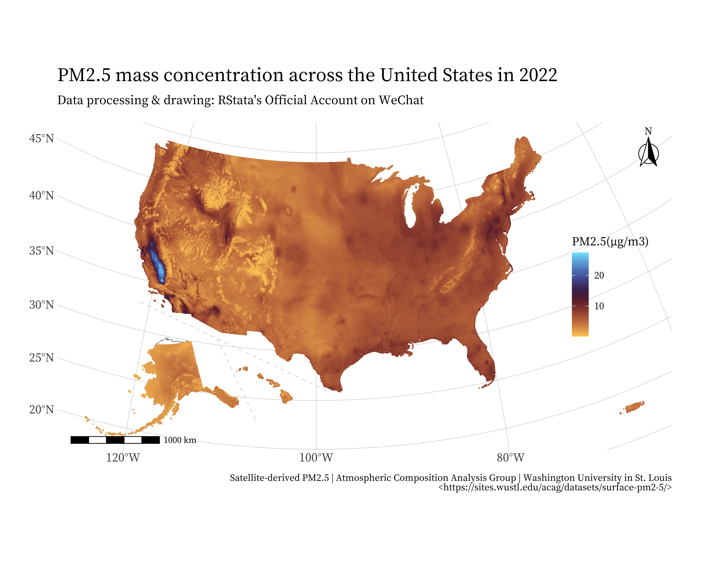
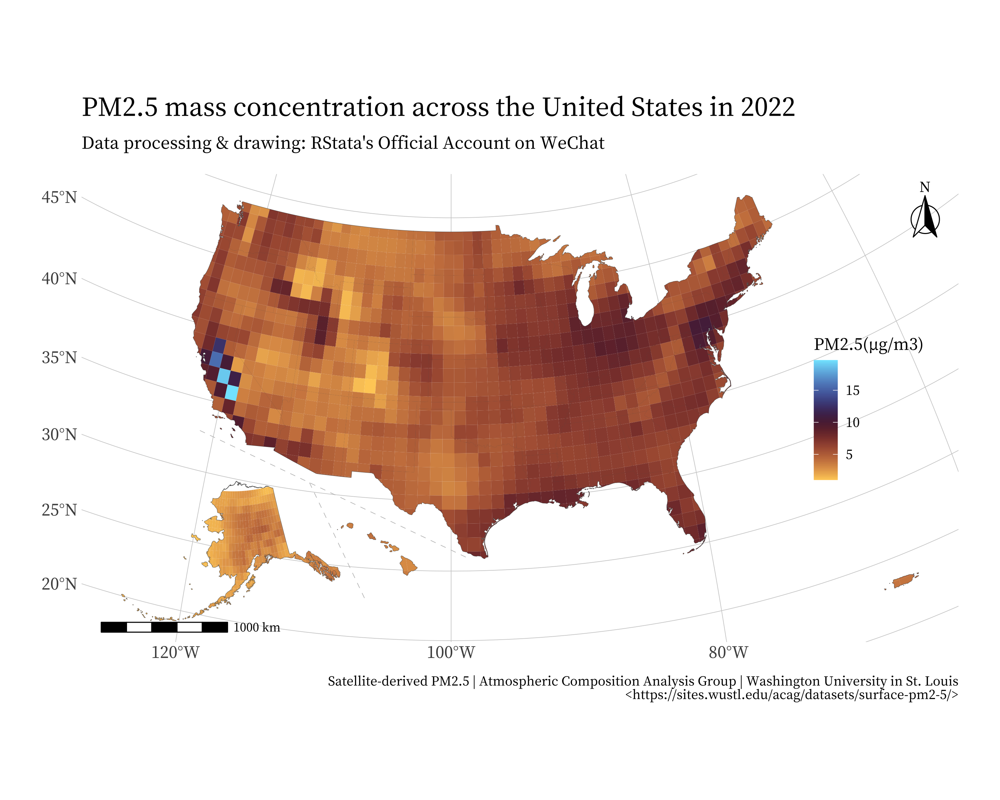
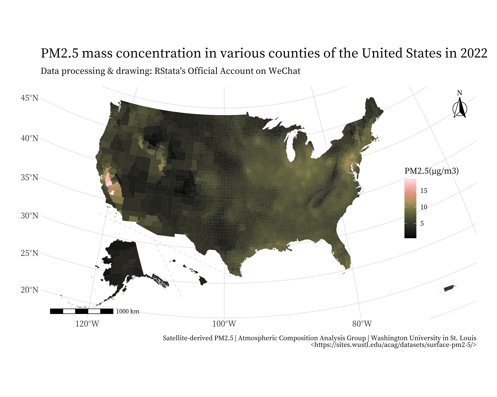

## usmap_r：使用 R 语言绘制美国州县地图

> 该数据及绘图方法由 `微信公众号 RStata` 设计，如需使用在商业文书、论文或者出版书籍中，需要购买 RStata 会员进而获得授权。（购买链接：[https://rstata.duanshu.com/#/](https://rstata.duanshu.com/#/)）。

今天给大家分享使用 R 语言绘制美国州县地图，虽然 R 语言中有这样的包，例如 usmap 包，不过如果大家不了解背后的数据结构，很难很好的使用相关的地图矢量数据以及绘制更复杂的图，因此我们还是讲解如何使用 shp 数据绘制美国州县地图。

## 数据准备

附件中有 5 个文件夹：

+ gz_2010_us_040_00_20m：美国州级原始矢量数据；
+ gz_2010_us_050_00_20m：美国县级原始矢量数据；
+ us_states：调整阿拉斯加和夏威夷位置的美国州级矢量数据；
+ us_counties：调整阿拉斯加和夏威夷位置的美国县级矢量数据；
+ separate_line：分隔线的矢量数据。

如果想要进行地理计算建议使用原始的矢量数据，如果绘图则需要使用调整阿拉斯加和夏威夷位置的矢量数据，这样绘制得到的图会更好看。

调整代码也在附件中：`地图数据设计.R`，感兴趣的小伙伴可以自行研究下。调整后的地图数据坐标系是 “+proj=laea +lat_0=45 +lon_0=-100 +x_0=0 +y_0=0 +a=6370997 +b=6370997 +units=m +no_defs”。

## 绘制美国地图 + 散点图

附件中的 `global_power_plant_database_v_1_3` 文件夹里面存放的是全球发电厂数据，下面我们想绘制美国的发电厂分布及发电容量的大小。

首先我们需要使用美国的原始矢量数据根据经纬度提取位于美国境内的发电厂数据（实际上也可以用发电厂里面的国别变量筛选）：

```r
library(tidyverse)
library(sf)
library(ggspatial)
albers_proj <- "+proj=laea +lat_0=45 +lon_0=-100 +x_0=0 +y_0=0 +a=6370997 +b=6370997 +units=m +no_defs"
# 读取美国各州矢量数据（用于筛选美国范围的坐标点）
read_sf("gz_2010_us_040_00_20m/gz_2010_us_040_00_20m.shp") %>% 
  st_transform(albers_proj) -> states
# 发电厂数据
read_csv("global_power_plant_database_v_1_3/global_power_plant_database.csv") -> ppd

# ppd 数据转 sf 对象
ppd %>% 
  filter(!is.na(longitude) & !is.na(latitude)) %>% 
  st_as_sf(coords = c("longitude", "latitude"), crs = 4326, remove = F) %>% 
  st_transform(albers_proj) -> ppdsf 

ppdsf

#> Simple feature collection with 34936 features and 36 fields
#> Geometry type: POINT
#> Dimension:     XY
#> Bounding box:  xmin: -12236360 ymin: -11227180 xmax: 11910950 ymax: 11489730
#> Projected CRS: +proj=laea +lat_0=45 +lon_0=-100 +x_0=0 +y_0=0 +a=6370997 +b=6370997 +units=m +no_defs
#> # A tibble: 34,936 × 37
#>    country country_long name            gppd_idnr capacity_mw latitude longitude
#>  * <chr>   <chr>        <chr>           <chr>           <dbl>    <dbl>     <dbl>
#>  1 AFG     Afghanistan  Kajaki Hydroel… GEODB004…        33       32.3      65.1
#>  2 AFG     Afghanistan  Kandahar DOG    WKS00701…        10       31.7      65.8
#>  3 AFG     Afghanistan  Kandahar JOL    WKS00711…        10       31.6      65.8
#>  4 AFG     Afghanistan  Mahipar Hydroe… GEODB004…        66       34.6      69.5
#>  5 AFG     Afghanistan  Naghlu Dam Hyd… GEODB004…       100       34.6      69.7
#>  6 AFG     Afghanistan  Nangarhar (Dar… GEODB004…        11.6     34.5      70.4
#>  7 AFG     Afghanistan  Northwest Kabu… GEODB004…        42       34.6      69.1
#>  8 AFG     Afghanistan  Pul-e-Khumri H… GEODB004…         6       35.9      68.7
#>  9 AFG     Afghanistan  Sarobi Dam Hyd… GEODB004…        22       34.6      69.8
#> 10 ALB     Albania      Bistrica 1      WRI10021…        27       39.9      20.1
#> # ℹ 34,926 more rows
#> # ℹ 30 more variables: primary_fuel <chr>, other_fuel1 <chr>,
#> #   other_fuel2 <chr>, other_fuel3 <lgl>, commissioning_year <dbl>,
#> #   owner <chr>, source <chr>, url <chr>, geolocation_source <chr>,
#> #   wepp_id <chr>, year_of_capacity_data <dbl>, generation_gwh_2013 <dbl>,
#> #   generation_gwh_2014 <dbl>, generation_gwh_2015 <dbl>,
#> #   generation_gwh_2016 <dbl>, generation_gwh_2017 <dbl>, …
```

把发电厂数据提取三份，因为阿拉斯加和夏威夷的坐标点需要进行特定的坐标变换：

```r
# 三部分地区的矢量数据
subset(states, !STATE %in% c("15", "02")) -> mainus 
subset(states, STATE == "02") -> alaska
subset(states, STATE == "15") -> hawaii

# 提取美国本土的
ppdsf %>% 
  st_intersection(mainus) -> usppdsf1 

# 提取阿拉斯加的
ppdsf %>% 
  st_intersection(alaska) -> usppdsf2 

# 提取夏威夷的
ppdsf %>% 
  st_intersection(hawaii) -> usppdsf3 
```

阿拉斯加的点需要按照下面的规则平移：

```r
rotation = function(a){
  r = a * pi / 180 
  matrix(c(cos(r), sin(r), -sin(r), cos(r)), 
         nrow = 2, ncol = 2)
}

usppdsf2 %>% 
  mutate(geometry = geometry * rotation(-50) / 2 + c(300000, -2000000)) %>% 
  st_set_crs(albers_proj) -> usppdsf2a 
```

夏威夷的点需要按照下面的规则平移：

```r
usppdsf3 %>% 
  mutate(geometry = geometry * rotation(-35) + c(3600000, 1800000)) %>% 
  st_set_crs(albers_proj) -> usppdsf3a 
```

合并三部分散点数据：

```r
bind_rows(usppdsf1, usppdsf2a, usppdsf3a) -> pointsallsf 
pointsallsf

#> Simple feature collection with 9799 features and 41 fields
#> Geometry type: POINT
#> Dimension:     XY
#> Bounding box:  xmin: -2029172 ymin: -2526757 xmax: 3646652 ymax: 729844.7
#> Projected CRS: +proj=laea +lat_0=45 +lon_0=-100 +x_0=0 +y_0=0 +a=6370997 +b=6370997 +units=m +no_defs
#> # A tibble: 9,799 × 42
#>    country country_long           name  gppd_idnr capacity_mw latitude longitude
#>  * <chr>   <chr>                  <chr> <chr>           <dbl>    <dbl>     <dbl>
#>  1 USA     United States of Amer… AES … USA00618…        10       33.4     -112.
#>  2 USA     United States of Amer… AZ S… USA00626…         2.4     33.4     -112.
#>  3 USA     United States of Amer… Actu… USA00586…         3       32.2     -111.
#>  4 USA     United States of Amer… Agua… USA00573…       348.      33.0     -113.
#>  5 USA     United States of Amer… Agua… USA00001…       614.      33.6     -112.
#>  6 USA     United States of Amer… Amph… USA00606…         1       32.3     -111.
#>  7 USA     United States of Amer… Apac… USA00609…        20       32.1     -110.
#>  8 USA     United States of Amer… Apac… USA00001…       661.      32.1     -110.
#>  9 USA     United States of Amer… Ariz… USA00581…        17.1     33.4     -112.
#> 10 USA     United States of Amer… Ariz… USA00577…         4.7     32.7     -114.
#> # ℹ 9,789 more rows
#> # ℹ 35 more variables: primary_fuel <chr>, other_fuel1 <chr>,
#> #   other_fuel2 <chr>, other_fuel3 <lgl>, commissioning_year <dbl>,
#> #   owner <chr>, source <chr>, url <chr>, geolocation_source <chr>,
#> #   wepp_id <chr>, year_of_capacity_data <dbl>, generation_gwh_2013 <dbl>,
#> #   generation_gwh_2014 <dbl>, generation_gwh_2015 <dbl>,
#> #   generation_gwh_2016 <dbl>, generation_gwh_2017 <dbl>, …
```

然后我们就可以使用调整后的美国地图数据进行绘图了：

```r
# 读取修改后的美国地图数据
read_sf("us_states/us_states.shp") -> us_states 
read_sf("separate_line/separate_line.shp") -> separate_line 
ggplot() + 
  geom_sf(data = us_states, fill = "white") + 
  geom_sf(data = pointsallsf, aes(color = capacity_mw,
                                   size = capacity_mw,
                                   alpha = capacity_mw)) + 
  geom_sf(data = separate_line, color = "gray", 
          linetype = 2, linewidth = 0.2) + 
  scico::scale_color_scico(palette = "lipari", 
                           breaks = seq(2000, 6000, by = 500),
                           name = "Capacity(MW)") + 
  guides(color = guide_legend()) + 
  scale_size_continuous(name = "Capacity(MW)",
                        breaks = seq(2000, 6000, by = 500),
                        range = c(0.01, 3)) + 
  scale_alpha_continuous(name = "Capacity(MW)",
                         breaks = seq(2000, 6000, by = 500),
                         range = c(0.3, 1)) + 
  theme(legend.position = c(0.9, 0.5),
        plot.background = element_rect(fill = "white", 
                                        color = "white")) + 
  annotation_scale(
    width_hint = 0.2,
    text_family = cnfont,
    pad_x = unit(0.5, "cm")
  ) + 
  annotation_north_arrow(
    location = "tr", which_north = "false",
    width = unit(1.2, "cm"), 
    height = unit(1.5, "cm"),
    style = north_arrow_fancy_orienteering(
      text_family = cnfont
    )
  ) + 
  labs(title = "Geographical distribution and power generation capacity \nof power plants in the United States",
       subtitle = "Data processing & drawing: RStata's Official Account on WeChat",
       caption = "Global Power Plant Database<https://datasets.wri.org/dataset/globalpowerplantdatabase>") -> p1 
ggsave("pic1.png", width = 10, height = 8, device = png)
```



## 绘制高分辨率的栅格地图

使用 ggplot2 绘制栅格地图需要先把栅格数据转换成 point 或 polygon（当然也有其他的方式，例如使用 tidyterra 包提供的一些图层）。这里可以使用 raster 包提供的一些函数进行转换。

`V6GL02.02.CNNPM25.Global.202201-202201.nc` 文件是来自华盛顿大学圣路易斯分校网站上的 2022 年全球 PM2.5 质量浓度栅格数据。下面我们从中裁剪出美国范围的进行绘图。

同样我们分别裁剪本土、阿拉斯加和夏威夷的，然后阿拉斯加和夏威夷的需要按照特定的规则进行变换：

```r
library(terra)
rast("V6GL02.02.CNNPM25.Global.202201-202201.nc") -> globalrst 

states %>% 
  st_transform(4326) -> states4326

subset(states4326, !STATE %in% c("15", "02")) -> mainus4326 
subset(states4326, STATE == "02") -> alaska4326
subset(states4326, STATE == "15") -> hawaii4326

# 裁剪
globalrst %>% 
  terra::crop(terra::vect(mainus4326)) %>% 
  terra::mask(terra::vect(mainus4326)) -> usrst1 
globalrst %>% 
  terra::crop(terra::vect(alaska4326)) %>% 
  terra::mask(terra::vect(alaska4326)) -> usrst2 
globalrst %>% 
  terra::crop(terra::vect(hawaii4326)) %>% 
  terra::mask(terra::vect(hawaii4326)) -> usrst3 
```

转换成点数据

```r
# 栅格数据转点数据
usrst1[usrst1<0] <- NA 
usrst1 %>% 
  raster::raster() %>% 
  raster::aggregate(fact = 4) %>% 
  raster::rasterToPoints(spatial = T) %>% 
  st_as_sf() %>% 
  st_transform(albers_proj) -> usrstpoints1
usrst2[usrst2<0] <- NA 
usrst2 %>% 
  raster::raster() %>% 
  raster::aggregate(fact = 4) %>% 
  raster::rasterToPoints(spatial = T) %>% 
  st_as_sf() %>% 
  st_transform(albers_proj) -> usrstpoints2
usrst3[usrst3<0] <- NA 
usrst3 %>% 
  raster::raster() %>% 
  raster::aggregate(fact = 4) %>% 
  raster::rasterToPoints(spatial = T) %>% 
  st_as_sf() %>% 
  st_transform(albers_proj) -> usrstpoints3
```

这里使用 `raster::aggregate(fact = 4)` 是为了降低栅格数据的分辨率，要不然太多的点会难以操作和绘图。

阿拉斯加和夏威夷的点需要按照预定的规则进行坐标变换：

```r
usrstpoints2 %>% 
  mutate(geometry = geometry * rotation(-50) / 2 + c(300000, -2000000)) %>% 
  st_set_crs(albers_proj) -> usrstpoints2a 

usrstpoints3 %>% 
  st_transform(albers_proj) %>% 
  mutate(geometry = geometry * rotation(-35) + c(3600000, 1800000)) %>% 
  st_set_crs(albers_proj) -> usrstpoints3a 

bind_rows(usrstpoints1, usrstpoints2a, usrstpoints3a) -> usrstpoints 
usrstpoints %>% 
  write_rds("usrstpoints.rds")
```

然后就可以绘制栅格地图了：

```r
ggplot() + 
  geom_sf(data = us_states, fill = "white") + 
  geom_sf(data = usrstpoints, aes(color = PM25), 
          shape = ".") + 
  geom_sf(data = separate_line, color = "gray", 
          linetype = 2, linewidth = 0.2) + 
  scico::scale_color_scico(palette = "managua", 
                           name = "PM2.5(µg/m3)") +
  theme(legend.position = c(0.9, 0.5),
        plot.background = element_rect(fill = "white",
                                      color = "white")) + 
  annotation_scale(
    width_hint = 0.2,
    text_family = cnfont,
    pad_x = unit(0.5, "cm")
  ) + 
  annotation_north_arrow(
    location = "tr", which_north = "false",
    width = unit(1.2, "cm"), 
    height = unit(1.5, "cm"),
    style = north_arrow_fancy_orienteering(
      text_family = cnfont
    )
  ) + 
  labs(title = "PM2.5 mass concentration across the United States in 2022",
       subtitle = "Data processing & drawing: RStata's Official Account on WeChat",
       caption = "Satellite-derived PM2.5 | Atmospheric Composition Analysis Group | Washington University in St. Louis\n <https://sites.wustl.edu/acag/datasets/surface-pm2-5/>") -> p2 
 
ggsave("pic2.png", width = 10, height = 8, device = png)
```



## 绘制低分辨率的栅格地图

如果是低分辨率的栅格数据，使用点绘制就会不好看了，这个时候可以考虑转换成 polygon 再绘制，使用 raster::rasterToPolygons() 即可：

```r
# 更大的聚合因子
usrst1 %>% 
  raster::raster() %>% 
  raster::aggregate(fact = 100) %>% 
  raster::rasterToPolygons() %>% 
  st_as_sf() %>% 
  st_transform(albers_proj) -> usrstpoly1
usrst2 %>% 
  raster::raster() %>% 
  raster::aggregate(fact = 100) %>% 
  raster::rasterToPolygons() %>% 
  st_as_sf() %>% 
  st_transform(albers_proj) -> usrstpoly2
usrst3 %>% 
  raster::raster() %>% 
  raster::aggregate(fact = 100) %>% 
  raster::rasterToPolygons() %>% 
  st_as_sf() %>% 
  st_transform(albers_proj) -> usrstpoly3

# 阿拉斯加和夏威夷的变换
usrstpoly2 %>% 
  mutate(geometry = geometry * rotation(-50) / 2 + c(300000, -2000000)) %>% 
  st_set_crs(albers_proj) -> usrstpoly2a 

usrstpoly3 %>% 
  st_transform(albers_proj) %>% 
  mutate(geometry = geometry * rotation(-35) + c(3600000, 1800000)) %>% 
  st_set_crs(albers_proj) -> usrstpoly3a 

bind_rows(usrstpoly1, usrstpoly2a, usrstpoly3a) -> usrstpoly
usrstpoly %>% 
  write_rds("usrstpoly.rds")

# 提取美国境内的
usrstpoly %>% 
  st_transform(st_crs(us_states)) %>% 
  st_intersection(us_states) -> usrstpoly2

# 绘制栅格地图
ggplot() + 
  geom_sf(data = us_states, fill = "white") + 
  geom_sf(data = usrstpoly2, aes(fill = PM25), 
          linewidth = 0.001, color = "white") + 
  geom_sf(data = separate_line, color = "gray", 
          linetype = 2, linewidth = 0.2) + 
  scico::scale_fill_scico(palette = "managua", 
                           name = "PM2.5(µg/m3) ") +
  theme(legend.position = c(0.9, 0.5),
        plot.background = element_rect(fill = "white",
                                       color = "white")) + 
  annotation_scale( 
    width_hint = 0.2, 
    text_family = cnfont,
    pad_x = unit(0.5, "cm")
  ) + 
  annotation_north_arrow(
    location = "tr", which_north = "false",
    width = unit(1.2, "cm"), 
    height = unit(1.5, "cm"),
    style = north_arrow_fancy_orienteering(
      text_family = cnfont
    )
  ) + 
  labs(title = "PM2.5 mass concentration across the United States in 2022",
       subtitle = "Data processing & drawing: RStata's Official Account on WeChat",
       caption = "Satellite-derived PM2.5 | Atmospheric Composition Analysis Group | Washington University in St. Louis\n <https://sites.wustl.edu/acag/datasets/surface-pm2-5/>") -> p3

ggsave("pic3.png", width = 10, height = 8, device = png) 
```



## 栅格数据的分区域平均与填充地图的绘制

最后我们再以区县地图为例讲解填充地图的绘制。

裁剪与汇总栅格数据也需要使用原始的美国地图数据：

```r
# 读取原始的美国地图数据（分区域平均栅格数据）
read_sf("gz_2010_us_050_00_20m/gz_2010_us_050_00_20m.shp") %>% 
  st_transform(4326) %>% 
  mutate(fips = paste0(STATE, COUNTY)) %>% 
  select(fips) -> counties 
counties 

#> Simple feature collection with 3221 features and 1 field
#> Geometry type: MULTIPOLYGON
#> Dimension:     XY
#> Bounding box:  xmin: -179.1473 ymin: 17.88481 xmax: 179.7785 ymax: 71.35256
#> Geodetic CRS:  WGS 84
#> # A tibble: 3,221 × 2
#>    fips                                                                 geometry
#>    <chr>                                                      <MULTIPOLYGON [°]>
#>  1 01001 (((-86.49677 32.34444, -86.7179 32.40281, -86.81491 32.3408, -86.89058…
#>  2 01009 (((-86.5778 33.76532, -86.75914 33.84062, -86.95366 33.8153, -86.9543 …
#>  3 01017 (((-85.18413 32.87053, -85.12342 32.77225, -85.13204 32.76421, -85.136…
#>  4 01021 (((-86.51734 33.02057, -86.51596 32.92936, -86.45701 32.8139, -86.3749…
#>  5 01033 (((-88.13999 34.5817, -88.13925 34.5878, -88.13872 34.58921, -88.11841…
#>  6 01045 (((-85.41644 31.61947, -85.41743 31.31497, -85.48585 31.2461, -85.6599…
#>  7 01051 (((-86.33678 32.76747, -86.31948 32.7537, -86.00719 32.75498, -85.8798…
#>  8 01065 (((-87.4212 32.87451, -87.47217 32.83062, -87.47391 32.65587, -87.5252…
#>  9 01079 (((-87.10507 34.68604, -87.10591 34.58764, -87.11011 34.3138, -87.1099…
#> 10 01083 (((-86.83631 34.99176, -86.82066 34.99176, -86.78365 34.99193, -86.783…
#> # ℹ 3,211 more rows

# 分区域汇总栅格数据
# 合并上面的三部分栅格数据
list(usrst1, usrst2, usrst3) %>% 
  sprc() %>% 
  mosaic() -> usrst
usrst %>% 
  terra::extract(terra::vect(counties), 
                 fun = mean, na.rm = T) %>% 
  as_tibble() -> countydf 

countydf

#> # A tibble: 3,221 × 2
#>       ID  PM25
#>    <int> <dbl>
#>  1     1  6.60
#>  2     2  6.91
#>  3     3  6.45
#>  4     4  6.77
#>  5     5  6.78
#>  6     6  6.49
#>  7     7  6.69
#>  8     8  6.82
#>  9     9  6.74
#> 10    10  6.98
#> # ℹ 3,211 more rows

counties %>% 
  st_drop_geometry() %>% 
  mutate(ID = row_number()) %>% 
  left_join(countydf) -> PM25df 

PM25df

#> # A tibble: 3,221 × 3
#>    fips     ID  PM25
#>    <chr> <int> <dbl>
#>  1 01001     1  6.60
#>  2 01009     2  6.91
#>  3 01017     3  6.45
#>  4 01021     4  6.77
#>  5 01033     5  6.78
#>  6 01045     6  6.49
#>  7 01051     7  6.69
#>  8 01065     8  6.82
#>  9 01079     9  6.74
#> 10 01083    10  6.98
#> # ℹ 3,211 more rows
```

把该结果和调整后的美国县级地图合并：

```r
# 读取修改后的美国县级地图
read_sf("us_counties/us_counties.shp") -> us_counties
us_counties

#> Simple feature collection with 3221 features and 4 fields
#> Geometry type: MULTIPOLYGON
#> Dimension:     XY
#> Bounding box:  xmin: -2583940 ymin: -2601637 xmax: 3663702 ymax: 732103.3
#> Projected CRS: +proj=laea +lat_0=45 +lon_0=-100 +x_0=0 +y_0=0 +ellps=sphere +units=m +no_defs
#> # A tibble: 3,221 × 5
#>    fips  abbr  full    county                                           geometry
#>    <chr> <chr> <chr>   <chr>                                  <MULTIPOLYGON [m]>
#>  1 01001 AL    Alabama Autauga County   (((1269841 -1303980, 1248372 -1300830, …
#>  2 01009 AL    Alabama Blount County    (((1240383 -1149119, 1222632 -1143475, …
#>  3 01017 AL    Alabama Chambers County  (((1382944 -1225846, 1390214 -1235634, …
#>  4 01021 AL    Alabama Chilton County   (((1257515 -1230045, 1259055 -1240041, …
#>  5 01033 AL    Alabama Colbert County   (((1085910 -1080751, 1085892 -1080071, …
#>  6 01045 AL    Alabama Dale County      (((1382203 -1366760, 1387076 -1400145, …
#>  7 01051 AL    Alabama Elmore County    (((1278144 -1255151, 1279961 -1256403, …
#>  8 01065 AL    Alabama Hale County      (((1176099 -1258997, 1172005 -1264523, …
#>  9 01079 AL    Alabama Lawrence County  (((1178216 -1055420, 1179636 -1066254, …
#> 10 01083 AL    Alabama Limestone County (((1197770 -1018013, 1199180 -1017791, …
#> # ℹ 3,211 more rows

# 修改后的区县矢量数据合并 PM2.5 数据
us_counties %>% 
  left_join(PM25df) %>% 
  select(-ID) -> us_counties2
```

然后就可以绘制填充地图了：

```r
ggplot() + 
  geom_sf(data = us_counties2, aes(fill = PM25),
          linewidth = 0.001, color = NA) + 
  geom_sf(data = separate_line, color = "gray", 
          linetype = 2, linewidth = 0.2) + 
  scico::scale_fill_scico(palette = "turku", 
                          name = "PM2.5(µg/m3) ") +
  theme(legend.position = c(0.9, 0.5),
        plot.background = element_rect(fill = "white", 
                                       color = "white")) + 
  annotation_scale(
    width_hint = 0.2,
    text_family = cnfont,
    pad_x = unit(0.5, "cm")
  ) + 
  annotation_north_arrow(
    location = "tr", which_north = "false",
    width = unit(1.2, "cm"), 
    height = unit(1.5, "cm"),
    style = north_arrow_fancy_orienteering(
      text_family = cnfont
    )
  ) + 
  labs(title = "PM2.5 mass concentration in various counties of the United States in 2022",
       subtitle = "Data processing & drawing: RStata's Official Account on WeChat",
       caption = "Satellite-derived PM2.5 | Atmospheric Composition Analysis Group | Washington University in St. Louis\n <https://sites.wustl.edu/acag/datasets/surface-pm2-5/>") -> p4

ggsave("pic4.png", width = 10, height = 8, device = png)
```



------------

<h4 align="center">

使用须知

</h4>

<h6 align="center">

该数据及绘图方法由 <b>微信公众号 RStata </b> 设计，如需使用在商业文书、论文或者出版书籍中，需要购买 RStata 会员进而获得授权。购买链接：<a href='https://rstata.duanshu.com/#/'>https://rstata.duanshu.com/#/</a>）。

</h6>

<h4 align="center">

License

</h4>

<h6 align="center">

© 微信公众号 RStata

</h6>
