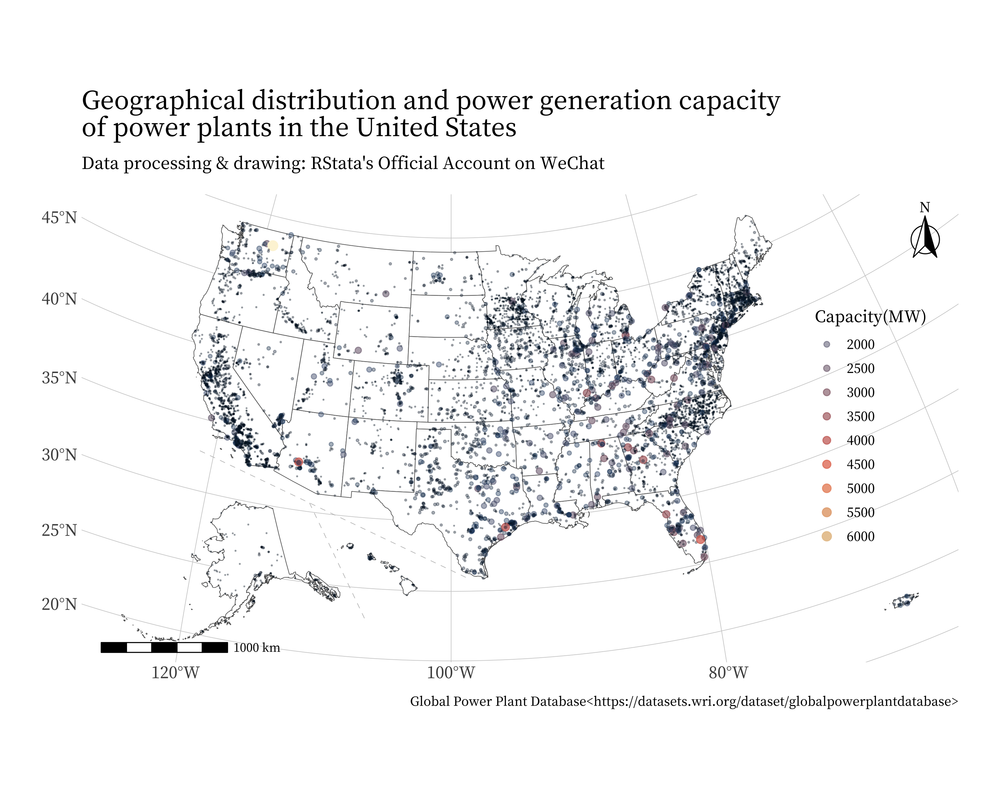
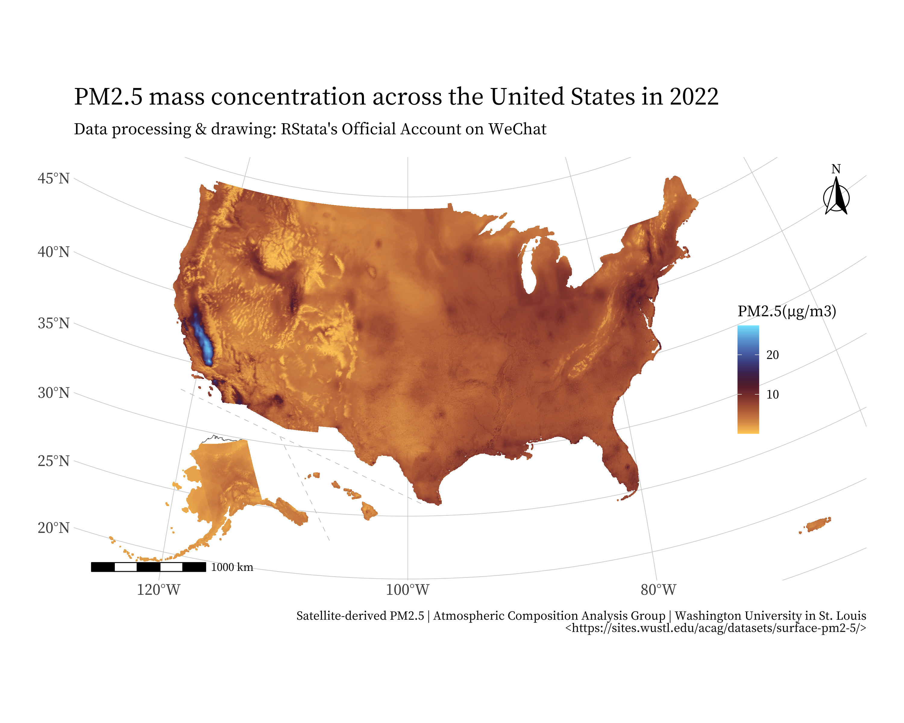
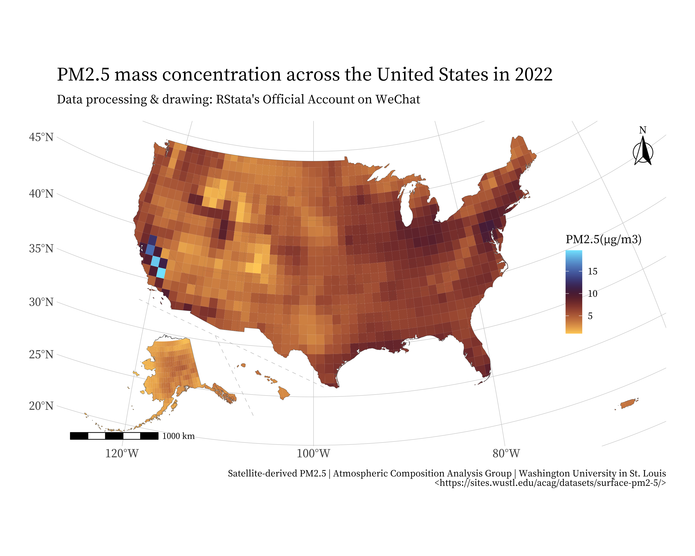
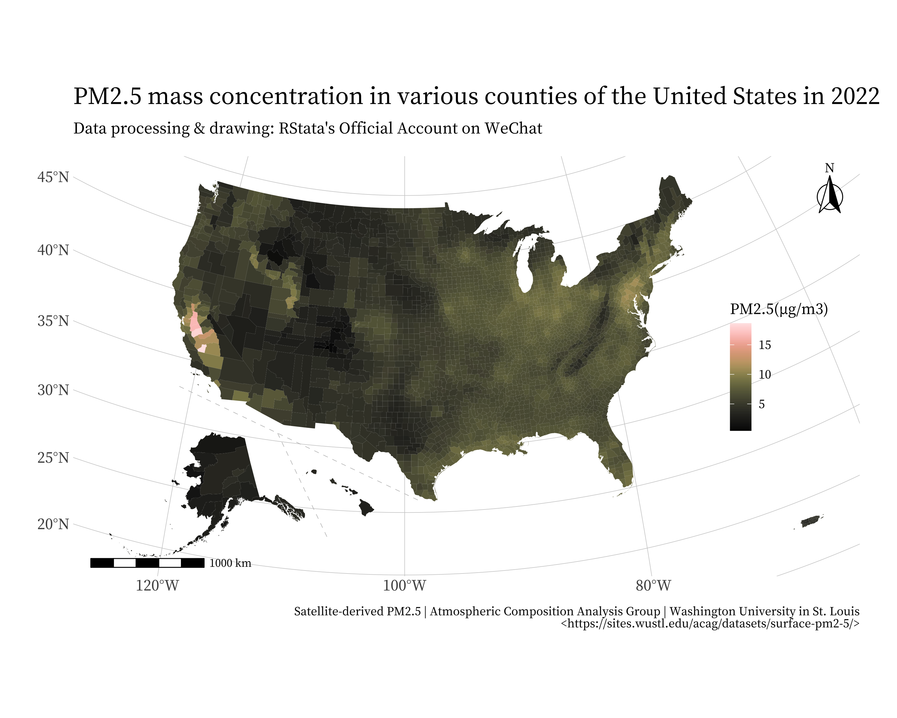

```{r setup, include=FALSE}
knitr::opts_chunk$set(echo = TRUE,
                      dpi = 400,
                      warning = FALSE,
                      message = FALSE,
                      # out.width = "100%",
                      # out.height = "500px",
                      fig.align = 'center',
                      attr.output = ".comment",
                      comment = "#>")
```

今天给大家分享使用 R 语言绘制美国州县地图，虽然 R 语言中有这样的包，例如 usmap 包，不过如果大家不了解背后的数据结构，很难很好的使用相关的地图矢量数据以及绘制更复杂的图，因此我们还是讲解如何使用 shp 数据绘制美国州县地图。

## 数据准备

附件中有 5 个文件夹：

+ gz_2010_us_040_00_20m：美国州级原始矢量数据；
+ gz_2010_us_050_00_20m：美国县级原始矢量数据；
+ us_states：调整阿拉斯加和夏威夷位置的美国州级矢量数据；
+ us_counties：调整阿拉斯加和夏威夷位置的美国县级矢量数据；
+ separate_line：分隔线的矢量数据。

如果想要进行地理计算建议使用原始的矢量数据，如果绘图则需要使用调整阿拉斯加和夏威夷位置的矢量数据，这样绘制得到的图会更好看。

调整代码也在附件中：`地图数据设计.R`，感兴趣的小伙伴可以自行研究下。调整后的地图数据坐标系是 “+proj=laea +lat_0=45 +lon_0=-100 +x_0=0 +y_0=0 +a=6370997 +b=6370997 +units=m +no_defs”。

## 绘制美国地图 + 散点图

附件中的 `global_power_plant_database_v_1_3` 文件夹里面存放的是全球发电厂数据，下面我们想绘制美国的发电厂分布及发电容量的大小。

首先我们需要使用美国的原始矢量数据根据经纬度提取位于美国境内的发电厂数据（实际上也可以用发电厂里面的国别变量筛选）：

```{r}
library(tidyverse)
library(sf)
library(ggspatial)
albers_proj <- "+proj=laea +lat_0=45 +lon_0=-100 +x_0=0 +y_0=0 +a=6370997 +b=6370997 +units=m +no_defs"
# 读取美国各州矢量数据（用于筛选美国范围的坐标点）
read_sf("gz_2010_us_040_00_20m/gz_2010_us_040_00_20m.shp") %>% 
  st_transform(albers_proj) -> states
# 发电厂数据
read_csv("global_power_plant_database_v_1_3/global_power_plant_database.csv") -> ppd

# ppd 数据转 sf 对象
ppd %>% 
  filter(!is.na(longitude) & !is.na(latitude)) %>% 
  st_as_sf(coords = c("longitude", "latitude"), crs = 4326, remove = F) %>% 
  st_transform(albers_proj) -> ppdsf 

ppdsf
```

把发电厂数据提取三份，因为阿拉斯加和夏威夷的坐标点需要进行特定的坐标变换：

```{r}
# 三部分地区的矢量数据
subset(states, !STATE %in% c("15", "02")) -> mainus 
subset(states, STATE == "02") -> alaska
subset(states, STATE == "15") -> hawaii

# 提取美国本土的
ppdsf %>% 
  st_intersection(mainus) -> usppdsf1 

# 提取阿拉斯加的
ppdsf %>% 
  st_intersection(alaska) -> usppdsf2 

# 提取夏威夷的
ppdsf %>% 
  st_intersection(hawaii) -> usppdsf3 
```

阿拉斯加的点需要按照下面的规则平移：

```{r}
rotation = function(a){
  r = a * pi / 180 
  matrix(c(cos(r), sin(r), -sin(r), cos(r)), 
         nrow = 2, ncol = 2)
}

usppdsf2 %>% 
  mutate(geometry = geometry * rotation(-50) / 2 + c(300000, -2000000)) %>% 
  st_set_crs(albers_proj) -> usppdsf2a 
```

夏威夷的点需要按照下面的规则平移：

```{r}
usppdsf3 %>% 
  mutate(geometry = geometry * rotation(-35) + c(3600000, 1800000)) %>% 
  st_set_crs(albers_proj) -> usppdsf3a 
```

合并三部分散点数据：

```{r}
bind_rows(usppdsf1, usppdsf2a, usppdsf3a) -> pointsallsf 
pointsallsf
```

然后我们就可以使用调整后的美国地图数据进行绘图了：

```{r}
# 读取修改后的美国地图数据
read_sf("us_states/us_states.shp") -> us_states 
read_sf("separate_line/separate_line.shp") -> separate_line 
ggplot() + 
  geom_sf(data = us_states, fill = "white") + 
  geom_sf(data = pointsallsf, aes(color = capacity_mw,
                                   size = capacity_mw,
                                   alpha = capacity_mw)) + 
  geom_sf(data = separate_line, color = "gray", 
          linetype = 2, linewidth = 0.2) + 
  scico::scale_color_scico(palette = "lipari", 
                           breaks = seq(2000, 6000, by = 500),
                           name = "Capacity(MW)") + 
  guides(color = guide_legend()) + 
  scale_size_continuous(name = "Capacity(MW)",
                        breaks = seq(2000, 6000, by = 500),
                        range = c(0.01, 3)) + 
  scale_alpha_continuous(name = "Capacity(MW)",
                         breaks = seq(2000, 6000, by = 500),
                         range = c(0.3, 1)) + 
  theme(legend.position = c(0.9, 0.5),
        plot.background = element_rect(fill = "white", 
                                        color = "white")) + 
  annotation_scale(
    width_hint = 0.2,
    text_family = cnfont,
    pad_x = unit(0.5, "cm")
  ) + 
  annotation_north_arrow(
    location = "tr", which_north = "false",
    width = unit(1.2, "cm"), 
    height = unit(1.5, "cm"),
    style = north_arrow_fancy_orienteering(
      text_family = cnfont
    )
  ) + 
  labs(title = "Geographical distribution and power generation capacity \nof power plants in the United States",
       subtitle = "Data processing & drawing: RStata's Official Account on WeChat",
       caption = "Global Power Plant Database<https://datasets.wri.org/dataset/globalpowerplantdatabase>") -> p1 
ggsave("pic1.png", width = 10, height = 8, device = png)
```



## 绘制高分辨率的栅格地图

使用 ggplot2 绘制栅格地图需要先把栅格数据转换成 point 或 polygon（当然也有其他的方式，例如使用 tidyterra 包提供的一些图层）。这里可以使用 raster 包提供的一些函数进行转换。

`V6GL02.02.CNNPM25.Global.202201-202201.nc` 文件是来自华盛顿大学圣路易斯分校网站上的 2022 年全球 PM2.5 质量浓度栅格数据。下面我们从中裁剪出美国范围的进行绘图。

同样我们分别裁剪本土、阿拉斯加和夏威夷的，然后阿拉斯加和夏威夷的需要按照特定的规则进行变换：

```{r}
library(terra)
rast("V6GL02.02.CNNPM25.Global.202201-202201.nc") -> globalrst 

states %>% 
  st_transform(4326) -> states4326

subset(states4326, !STATE %in% c("15", "02")) -> mainus4326 
subset(states4326, STATE == "02") -> alaska4326
subset(states4326, STATE == "15") -> hawaii4326

# 裁剪
globalrst %>% 
  terra::crop(terra::vect(mainus4326)) %>% 
  terra::mask(terra::vect(mainus4326)) -> usrst1 
globalrst %>% 
  terra::crop(terra::vect(alaska4326)) %>% 
  terra::mask(terra::vect(alaska4326)) -> usrst2 
globalrst %>% 
  terra::crop(terra::vect(hawaii4326)) %>% 
  terra::mask(terra::vect(hawaii4326)) -> usrst3 
```

转换成点数据

```{r}
# 栅格数据转点数据
usrst1[usrst1<0] <- NA 
usrst1 %>% 
  raster::raster() %>% 
  raster::aggregate(fact = 4) %>% 
  raster::rasterToPoints(spatial = T) %>% 
  st_as_sf() %>% 
  st_transform(albers_proj) -> usrstpoints1
usrst2[usrst2<0] <- NA 
usrst2 %>% 
  raster::raster() %>% 
  raster::aggregate(fact = 4) %>% 
  raster::rasterToPoints(spatial = T) %>% 
  st_as_sf() %>% 
  st_transform(albers_proj) -> usrstpoints2
usrst3[usrst3<0] <- NA 
usrst3 %>% 
  raster::raster() %>% 
  raster::aggregate(fact = 4) %>% 
  raster::rasterToPoints(spatial = T) %>% 
  st_as_sf() %>% 
  st_transform(albers_proj) -> usrstpoints3
```

这里使用 `raster::aggregate(fact = 4)` 是为了降低栅格数据的分辨率，要不然太多的点会难以操作和绘图。

阿拉斯加和夏威夷的点需要按照预定的规则进行坐标变换：

```{r}
usrstpoints2 %>% 
  mutate(geometry = geometry * rotation(-50) / 2 + c(300000, -2000000)) %>% 
  st_set_crs(albers_proj) -> usrstpoints2a 

usrstpoints3 %>% 
  st_transform(albers_proj) %>% 
  mutate(geometry = geometry * rotation(-35) + c(3600000, 1800000)) %>% 
  st_set_crs(albers_proj) -> usrstpoints3a 

bind_rows(usrstpoints1, usrstpoints2a, usrstpoints3a) -> usrstpoints 
usrstpoints %>% 
  write_rds("usrstpoints.rds")
```

然后就可以绘制栅格地图了：

```{r}
ggplot() + 
  geom_sf(data = us_states, fill = "white") + 
  geom_sf(data = usrstpoints, aes(color = PM25), 
          shape = ".") + 
  geom_sf(data = separate_line, color = "gray", 
          linetype = 2, linewidth = 0.2) + 
  scico::scale_color_scico(palette = "managua", 
                           name = "PM2.5(µg/m3)") +
  theme(legend.position = c(0.9, 0.5),
        plot.background = element_rect(fill = "white",
                                      color = "white")) + 
  annotation_scale(
    width_hint = 0.2,
    text_family = cnfont,
    pad_x = unit(0.5, "cm")
  ) + 
  annotation_north_arrow(
    location = "tr", which_north = "false",
    width = unit(1.2, "cm"), 
    height = unit(1.5, "cm"),
    style = north_arrow_fancy_orienteering(
      text_family = cnfont
    )
  ) + 
  labs(title = "PM2.5 mass concentration across the United States in 2022",
       subtitle = "Data processing & drawing: RStata's Official Account on WeChat",
       caption = "Satellite-derived PM2.5 | Atmospheric Composition Analysis Group | Washington University in St. Louis\n <https://sites.wustl.edu/acag/datasets/surface-pm2-5/>") -> p2 
 
ggsave("pic2.png", width = 10, height = 8, device = png)
```



## 绘制低分辨率的栅格地图

如果是低分辨率的栅格数据，使用点绘制就会不好看了，这个时候可以考虑转换成 polygon 再绘制，使用 raster::rasterToPolygons() 即可：

```{r}
# 更大的聚合因子
usrst1 %>% 
  raster::raster() %>% 
  raster::aggregate(fact = 100) %>% 
  raster::rasterToPolygons() %>% 
  st_as_sf() %>% 
  st_transform(albers_proj) -> usrstpoly1
usrst2 %>% 
  raster::raster() %>% 
  raster::aggregate(fact = 100) %>% 
  raster::rasterToPolygons() %>% 
  st_as_sf() %>% 
  st_transform(albers_proj) -> usrstpoly2
usrst3 %>% 
  raster::raster() %>% 
  raster::aggregate(fact = 100) %>% 
  raster::rasterToPolygons() %>% 
  st_as_sf() %>% 
  st_transform(albers_proj) -> usrstpoly3

# 阿拉斯加和夏威夷的变换
usrstpoly2 %>% 
  mutate(geometry = geometry * rotation(-50) / 2 + c(300000, -2000000)) %>% 
  st_set_crs(albers_proj) -> usrstpoly2a 

usrstpoly3 %>% 
  st_transform(albers_proj) %>% 
  mutate(geometry = geometry * rotation(-35) + c(3600000, 1800000)) %>% 
  st_set_crs(albers_proj) -> usrstpoly3a 

bind_rows(usrstpoly1, usrstpoly2a, usrstpoly3a) -> usrstpoly
usrstpoly %>% 
  write_rds("usrstpoly.rds")

# 提取美国境内的
usrstpoly %>% 
  st_transform(st_crs(us_states)) %>% 
  st_intersection(us_states) -> usrstpoly2

# 绘制栅格地图
ggplot() + 
  geom_sf(data = us_states, fill = "white") + 
  geom_sf(data = usrstpoly2, aes(fill = PM25), 
          linewidth = 0.001, color = "white") + 
  geom_sf(data = separate_line, color = "gray", 
          linetype = 2, linewidth = 0.2) + 
  scico::scale_fill_scico(palette = "managua", 
                           name = "PM2.5(µg/m3) ") +
  theme(legend.position = c(0.9, 0.5),
        plot.background = element_rect(fill = "white",
                                       color = "white")) + 
  annotation_scale( 
    width_hint = 0.2, 
    text_family = cnfont,
    pad_x = unit(0.5, "cm")
  ) + 
  annotation_north_arrow(
    location = "tr", which_north = "false",
    width = unit(1.2, "cm"), 
    height = unit(1.5, "cm"),
    style = north_arrow_fancy_orienteering(
      text_family = cnfont
    )
  ) + 
  labs(title = "PM2.5 mass concentration across the United States in 2022",
       subtitle = "Data processing & drawing: RStata's Official Account on WeChat",
       caption = "Satellite-derived PM2.5 | Atmospheric Composition Analysis Group | Washington University in St. Louis\n <https://sites.wustl.edu/acag/datasets/surface-pm2-5/>") -> p3

ggsave("pic3.png", width = 10, height = 8, device = png) 
```



## 栅格数据的分区域平均与填充地图的绘制

最后我们再以区县地图为例讲解填充地图的绘制。

裁剪与汇总栅格数据也需要使用原始的美国地图数据：

```{r}
# 读取原始的美国地图数据（分区域平均栅格数据）
read_sf("gz_2010_us_050_00_20m/gz_2010_us_050_00_20m.shp") %>% 
  st_transform(4326) %>% 
  mutate(fips = paste0(STATE, COUNTY)) %>% 
  select(fips) -> counties 
counties 

# 分区域汇总栅格数据
# 合并上面的三部分栅格数据
list(usrst1, usrst2, usrst3) %>% 
  sprc() %>% 
  mosaic() -> usrst
usrst %>% 
  terra::extract(terra::vect(counties), 
                 fun = mean, na.rm = T) %>% 
  as_tibble() -> countydf 

countydf

counties %>% 
  st_drop_geometry() %>% 
  mutate(ID = row_number()) %>% 
  left_join(countydf) -> PM25df 

PM25df
```

把该结果和调整后的美国县级地图合并：

```{r}
# 读取修改后的美国县级地图
read_sf("us_counties/us_counties.shp") -> us_counties
us_counties

# 修改后的区县矢量数据合并 PM2.5 数据
us_counties %>% 
  left_join(PM25df) %>% 
  select(-ID) -> us_counties2
```

然后就可以绘制填充地图了：

```{r}
ggplot() + 
  geom_sf(data = us_counties2, aes(fill = PM25),
          linewidth = 0.001, color = NA) + 
  geom_sf(data = separate_line, color = "gray", 
          linetype = 2, linewidth = 0.2) + 
  scico::scale_fill_scico(palette = "turku", 
                          name = "PM2.5(µg/m3) ") +
  theme(legend.position = c(0.9, 0.5),
        plot.background = element_rect(fill = "white", 
                                       color = "white")) + 
  annotation_scale(
    width_hint = 0.2,
    text_family = cnfont,
    pad_x = unit(0.5, "cm")
  ) + 
  annotation_north_arrow(
    location = "tr", which_north = "false",
    width = unit(1.2, "cm"), 
    height = unit(1.5, "cm"),
    style = north_arrow_fancy_orienteering(
      text_family = cnfont
    )
  ) + 
  labs(title = "PM2.5 mass concentration in various counties of the United States in 2022",
       subtitle = "Data processing & drawing: RStata's Official Account on WeChat",
       caption = "Satellite-derived PM2.5 | Atmospheric Composition Analysis Group | Washington University in St. Louis\n <https://sites.wustl.edu/acag/datasets/surface-pm2-5/>") -> p4

ggsave("pic4.png", width = 10, height = 8, device = png)
```


